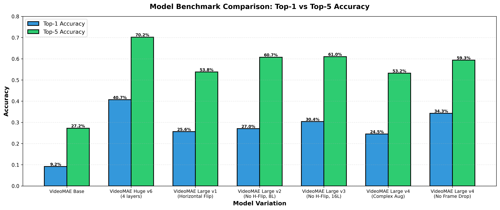

# Signrr — Sign Language Detection Backend 🤟

Real-time American Sign Language (ASL) detection and interpretation.

A fine-tuned **VideoMAE** model predicts glosses from webcam video, and an **LLM** turns
those gloss sequences into natural English. The LLM runs either **in the cloud via
OpenRouter** (no GPU needed) or **locally via a HuggingFace model** — switch between them
with a single environment variable. See `.env.example` for guide

The backend is a **FastAPI** app with WebSocket streaming, and also ships the pipelines used
to build the system: dataset engineering, VideoMAE fine-tuning, and MediaPipe motion capture
that produces the 3D bone-mapping animations used by the frontend avatar.

---

## Quick Start

You need **Python 3.11+** and [**uv**](https://docs.astral.sh/uv/) (`pip install uv`, or see
the [install docs](https://docs.astral.sh/uv/getting-started/installation/)).

```bash
# 1. Install dependencies (creates .venv automatically)
uv sync

# 2. Create your env file and add your keys
cp .env.example .env
#    → edit .env: set OPENROUTER_API_KEY (cloud mode) and HF_TOKEN

# 3. Run the API (auto-reload dev server on http://localhost:8000)
make dev
```

That's it. The VideoMAE model is **auto-downloaded from the HuggingFace Hub** on first run —
no manual model placement needed. Open the interactive API docs at
**http://localhost:8000/docs**.

By default (`LLM_BACKEND=cloud`) the app calls OpenRouter for sentence/chat generation, so it
runs comfortably on a machine **without a GPU** — you only need a CUDA GPU if you switch the
LLM to local mode or want to fine-tune models yourself.

---

## LLM Backends: Cloud vs Local

Sentence generation and chat are served by a pluggable backend, selected with `LLM_BACKEND`.
The factory (`src/api/sentence_generation/factory.py`) lazily imports only what the chosen
backend needs, so cloud mode never loads `transformers`.

| Mode | `LLM_BACKEND` | What runs | Needs | Best for |
| ---- | ------------- | --------- | ----- | -------- |
| **Cloud** *(default)* | `cloud` | `OPENROUTER_MODEL` over the OpenRouter API | `OPENROUTER_API_KEY` | No GPU / low local compute |
| **Local** | `local` | `LLM_MODEL_NAME` on this machine's GPU/CPU | GPU + weights (auto-downloaded) | Offline / privacy / no API cost |

Aliases are accepted: `cloud` = `openrouter`/`remote`/`api`, and `local` = `hf`/`huggingface`/`transformers`.

**Cloud (OpenRouter):**
```env
LLM_BACKEND="cloud"
OPENROUTER_API_KEY="sk-or-v1-..."
OPENROUTER_BASE_URL="https://openrouter.ai/api/v1"
OPENROUTER_MODEL="google/gemma-4-26b-a4b-it:free"
```

**Local (HuggingFace):**
```env
LLM_BACKEND="local"
LLM_MODEL_NAME="Qwen/Qwen3.5-4B"
LLM_USE_QUANTIZATION=true   # 4-bit via BitsAndBytes (~2GB VRAM)
LLM_DEVICE="auto"           # auto | cuda | cpu
```

> The OpenRouter client uses the OpenAI SDK against an OpenAI-compatible endpoint, so any
> OpenAI-compatible base URL/model works if you point `OPENROUTER_BASE_URL` elsewhere.

---

## Makefile

Common tasks are wrapped in the `makefile`:

```bash
make help    # list available targets
make dev     # dev server with auto-reload  → uvicorn ... --reload
make start   # production server (no reload)
```

Both serve `src.api.main:app` on `0.0.0.0:8000`. For multiple workers in production, run
`uvicorn src.api.main:app --host 0.0.0.0 --port 8000 --workers 4` directly.

---

## Configuration (`.env`)

All settings are read by `src/api/config.py` with sensible defaults. Copy `.env.example` and
override what you need.

| Variable | Default | Description |
| -------- | ------- | ----------- |
| `MODEL_PATH` | *(public HF repo)* | VideoMAE source: HF Hub repo ID or local directory |
| `HF_TOKEN` | `""` | HuggingFace token (for gated/private models) |
| `LLM_BACKEND` | `cloud` | `cloud` or `local` — where the LLM runs |
| `OPENROUTER_API_KEY` | `""` | Required in cloud mode |
| `OPENROUTER_MODEL` | `google/gemma-4-26b-a4b-it` | Cloud model id |
| `OPENROUTER_BASE_URL` | `https://openrouter.ai/api/v1` | OpenAI-compatible endpoint |
| `LLM_MODEL_NAME` | `Qwen/Qwen3.5-4B` | Local model (HF repo or path) |
| `LLM_USE_QUANTIZATION` | `true` | 4-bit BitsAndBytes for local model |
| `LLM_DEVICE` | `auto` | `auto` / `cuda` / `cpu` |
| `LLM_TEMPERATURE` | `0.5` | Sampling temperature |
| `LLM_MAX_LENGTH` | `100` | Max new tokens for sentence generation |
| `HOST` / `PORT` | `0.0.0.0` / `8000` | Server bind address |
| `CORS_ORIGINS` | `localhost:3000,3001` | Comma-separated allowed origins |
| `CONFIDENCE_THRESHOLD` | `0.0` | Min gloss confidence to keep |
| `NUM_FRAMES_TO_SAMPLE` | `16` | Frames sampled per video chunk |
| `MAX_GLOSSES_PER_SESSION` | `50` | Gloss buffer size per session |
| `DEDUPLICATE_CONSECUTIVE` | `true` | Drop repeated consecutive glosses |
| `SESSION_TIMEOUT_HOURS` | `2` | Inactive session cleanup window |
| `LOG_LEVEL` | `INFO` | Logging verbosity |

---

## API Endpoints

Full interactive docs: **`/docs`** (Swagger) and **`/redoc`**.

| Endpoint | Method | Purpose |
| -------- | ------ | ------- |
| `/ws/stream/{session_id}` | WebSocket | Stream video frames → live gloss predictions (session memory) |
| `/predict/video` | POST | Predict glosses from an uploaded video file |
| `/interpret-glosses` | POST | Top-5 gloss lattice → natural English sentence |
| `/glosses/to-sentence` | POST | Gloss sequence → sentence |
| `/convert-sentence-to-gloss` | POST | English sentence → gloss sequence |
| `/chat` | POST | Conversational chat with the LLM (optional session memory) |
| `/chat/stream` | POST | Token-by-token streaming chat (Server-Sent Events) |
| `/session/{session_id}/glosses` | GET / DELETE | Read or clear a session's gloss buffer |
| `/health` · `/ready` · `/stats` | GET | Health, readiness, and runtime stats |

**Interpret glosses** — each inner array is the top-5 predictions from one ~2s video chunk;
the LLM picks the most coherent path and paraphrases it:

```bash
curl -X POST http://localhost:8000/interpret-glosses \
  -H "Content-Type: application/json" \
  -d '{"input": [["I","WE","CLAP","SEE"], ["WANT","POOR","CAT"], ["CARD","FOOD","YOU"]]}'
# → {"sentence": "I want a card."}
```

**Streaming chat** (SSE):

```bash
curl -N -X POST http://localhost:8000/chat/stream \
  -H "Content-Type: application/json" \
  -d '{"message": "What is American Sign Language?", "session_id": "user-123"}'
# → data: {"token": "American"}
#   data: {"token": " Sign"} ...
```

---

## Project Structure

```
backend/
├── makefile                       # dev / start targets
├── .env.example                   # copy to .env
├── pyproject.toml · uv.lock       # uv dependencies
└── src/
    ├── api/                       # FastAPI app
    │   ├── main.py                # routes: WebSocket + REST + SSE
    │   ├── config.py              # env-driven configuration
    │   ├── videomae/              # VideoMAE inference service
    │   └── sentence_generation/
    │       ├── factory.py         # picks cloud vs local backend
    │       ├── sentence_service.py        # CloudSentenceService (OpenRouter)
    │       ├── sentence_service_local.py  # LocalSentenceService (HF)
    │       └── prompts.yml        # customizable ASL prompts
    ├── model/finetune/            # training pipelines
    │   ├── data_engineering/      # WLASL download / filter / validate
    │   ├── videomae/              # VideoMAE training + eval (primary)
    │   └── internvl3_5/           # VLM approach (legacy/experimental)
    ├── motion_capture/            # MediaPipe → 3D bone mapping
    └── app/                       # Streamlit demo UI
```

To customize how the LLM interprets glosses, edit `src/api/sentence_generation/prompts.yml`.

---

## Fine-tuning the VideoMAE Model

The gloss detector is VideoMAE fine-tuned on the [WLASL](https://dxli94.github.io/WLASL/)
dataset (282 classes). Run these from `src/model/finetune/`.

**1. Download WLASL videos** → `data_engineering/raw_videos/`
```bash
cd data_engineering && python video_downloader.py   # resumable; skips existing files
```

**2. Validate videos (important)** — ~15% of downloads are corrupted and crash training:
```bash
python validate_videos.py   # writes datasets/wlasl_validated.json
```

**3. (Optional) Pre-extract frames** for faster repeated training:
```bash
cd .. && python preprocess_videos.py
```

**4. Train**:
```bash
cd videomae && python train_video_mae.py   # checkpoints + TensorBoard logs written alongside
```

**5. Evaluate** (Top-1 / Top-5 accuracy):
```bash
python video_mae_eval.py
```

Training hyperparameters live in `src/model/params/vlm.yml`. Monitor runs with
`tensorboard --logdir <run>/tb_logs`. A CUDA GPU is strongly recommended (development was done
on an RTX 2000 Ada 8GB).

Once trained, push the model to the HuggingFace Hub and point `MODEL_PATH` at your repo id (or
a local checkpoint directory) so the API serves it.

### Model Benchmarks

| Variation | Top-1 | Top-5 | Notes |
| --------- | ----- | ----- | ----- |
| VideoMAE Base | 9.2% | 27.2% | Baseline |
| VideoMAE Large (16 layers) | 30.4% | 61.0% | Balanced config |
| VideoMAE Large (no frame drop) | 34.3% | 59.3% | |
| **VideoMAE Huge v6** | **40.7%** | **70.2%** | 🏆 4 unfrozen layers, optimized aug |



Larger capacity plus *moderate* augmentation win — overly aggressive augmentation (heavy
rotation/speed) hurt accuracy. Archived checkpoints live in
`src/model/finetune/archived_models/`.

> The `internvl3_5/` directory holds an alternative Vision-Language-Model approach. VideoMAE
> outperforms it for classification, so it's kept for reference only.

---

## Motion Capture (3D Bone Mapping for the Frontend Avatar)

The frontend renders a 3D avatar that *performs* each sign. Those animations come from running
WLASL videos through **MediaPipe Holistic**, which extracts body/hand/face motion and exports
Three.js-compatible JSON — one file per gloss in `motion_capture/motion_library/`.

Run from `src/motion_capture/`:

```bash
python inventory_videos.py     # 1. map glosses → video files (motion_dataset.json)
python process_all.py          # 2. extract motion → motion_library/GLOSS.json
python validate_extraction.py  # 3. quality-check the extracted library
```

Debug a single clip with an overlay video:
```bash
python visualize_single.py /path/to/video.mp4
```

Each output JSON contains 30 FPS frames with **body joint positions + quaternion rotations**
(shoulders, elbows, wrists), **21-landmark hand data with finger curls**, and **facial
blendshapes** (jaw open, mouth smile, eyebrow raise). The frontend applies the quaternions to
`SkinnedMesh` bones and the blendshapes to morph targets:

```js
const motion = await fetch("motion_library/ABOUT.json").then(r => r.json());
motion.frames.forEach((frame, i) => setTimeout(() => {
  const q = frame.body.left_shoulder_quat;
  leftShoulder.quaternion.set(q.x, q.y, q.z, q.w);
  if (frame.hands.left) leftThumb.rotation.z = frame.hands.left.thumb.curl * Math.PI;
  avatar.morphTargetInfluences[jawOpenIndex] = frame.face.jawOpen;
}, i * 33)); // 30 FPS ≈ 33ms/frame
```

Adjust extraction parameters (target FPS, MediaPipe confidence thresholds) at the top of
`extract_motion.py`. If hands/pose aren't detected, lower `min_detection_confidence` or check
video quality.

---

## Streamlit Demo

A standalone demo UI (browser webcam via WebRTC, works around WSL2 camera limits):

```bash
cd src/app && streamlit run streamlit_app.py   # http://localhost:8501
```

---

## Tech Stack

- **API:** FastAPI · Uvicorn · WebSockets · Server-Sent Events
- **ML:** PyTorch · HuggingFace Transformers · VideoMAE · PEFT/TRL (fine-tuning)
- **LLM:** OpenRouter (cloud, OpenAI SDK) · Qwen/HF models (local) · BitsAndBytes 4-bit
- **Motion capture:** MediaPipe Holistic (pose + hands + face mesh)
- **Data:** WLASL · Decord · OpenCV · scikit-learn (stratified splits)
- **Tooling:** uv (packaging) · YAML config · python-dotenv
- **Hardware:** CUDA (TF32/BF16) · CPU fallback

---

## Troubleshooting

- **`OPENROUTER_API_KEY` errors** — you're in cloud mode without a key. Set the key, or switch to `LLM_BACKEND=local`.
- **Slow / OOM local LLM** — enable `LLM_USE_QUANTIZATION=true`, pick a smaller `LLM_MODEL_NAME`, or use cloud mode.
- **Model download fails** — set a valid `HF_TOKEN` (some repos are gated) and check connectivity.
- **`.env` not applied** — it must sit in `backend/` (the project root); `config.py` loads it from there regardless of your working directory.
- **`moov atom not found` during training** — corrupted videos; run `validate_videos.py` and train on `wlasl_validated.json`.
- **Camera not working in WSL2** — the Streamlit app uses browser WebRTC to bypass this; ensure you open it in a Windows browser.

---

## License

MIT — see [LICENSE](LICENSE).
